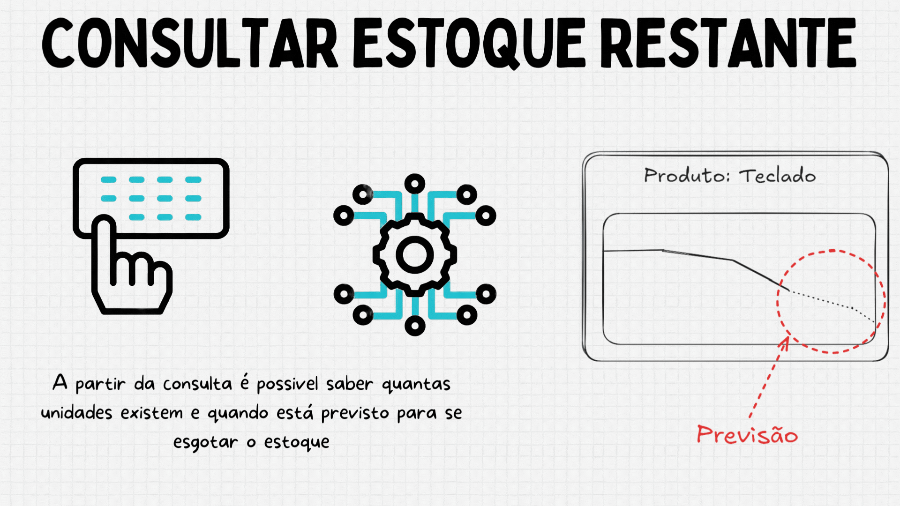

# Previsão de Estoque!

Ter em mãos quando determinado produto irá se esgotar pode ser estratégico para empresas de varejo, o que nem sempre é fácil devido as diversas variáveis, mas seguindo uma série de padrões pode ser mais fácil essa previsão, pensando nessa problemática decidi criar um programa que utiliza ML a fim de unir diversos dados e recorrencias ao longo de um extenso BD, tirando insights sobre a variação produto-vendas, relacionando então em um algoritmo que une a previsão de vendas para os próximos dias até que se de o fim do estoque.




# Tecnologias e Ferramentas

  
  


# Passo a passo para instanciar o projeto

Para começar, em uma pasta vazia clone o repositório com:

```bash
git clone https://github.com/RyanFBertaglia/StockForecast.git .

```

## Gerar os modelos

Como cada produto segue um padrão diferente, opetei por utilizar um modelo para cada produto, sendo necessário para inicializar o projeto rodar:
```bash
cd learn
```

```python
python main.py
```

*Observação:*
- 
Caso queira utilizar os mesmos dados que utilizei, deixei um arquivo que permite criar dados mockados para teste dos modelos, para inicializar esse banco de dados:
```python
python create-db.py
```
Caso contrário deixe o seu banco de dados (SQLite) nomeado como *store.db* dentro da pasta *training*

